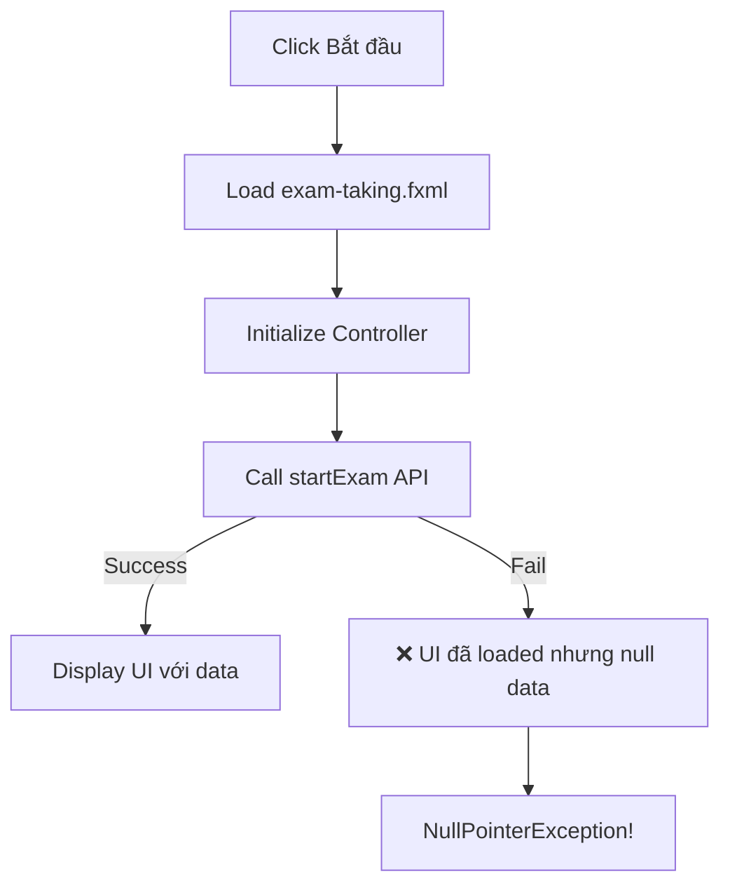
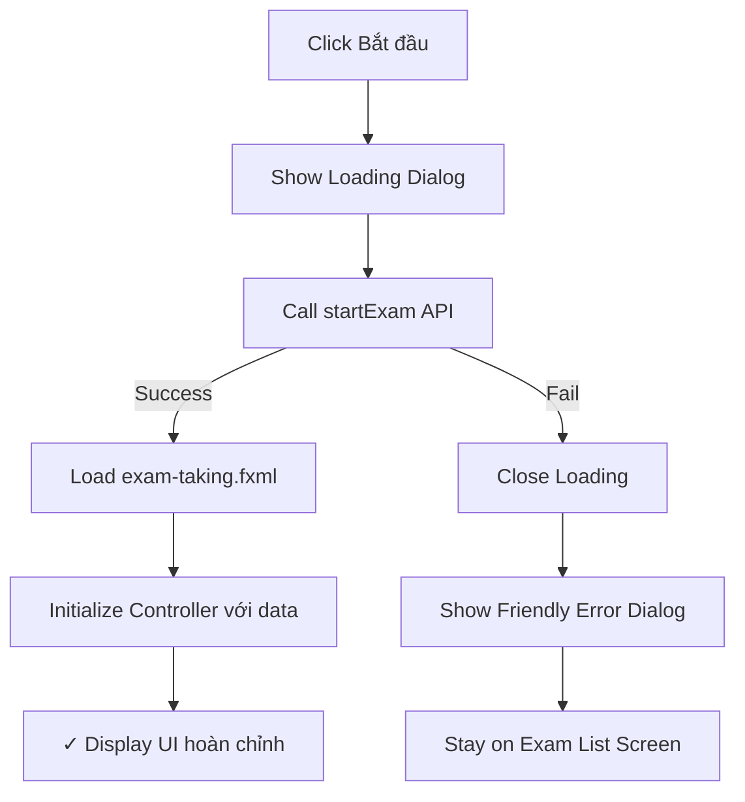

# Phase 8.6 - Bug Fix: studentInfoLabel NullPointerException - COMPLETE ✅

**Ngày hoàn thành:** 24/11/2025 11:54
**Người thực hiện:** K24DTCN210-NVMANH

## 📋 Tổng Quan

Sửa lỗi `NullPointerException: cannot invoke "javafx.scene.control.Label.setText(String)" because this.studentInfoLabel is null` khi bắt đầu làm bài thi.

### ❌ Vấn Đề Ban Đầu

Khi user click "Bắt đầu làm bài", gặp lỗi:
```
NullPointerException: cannot invoke "javafx.scene.control.Label.setText(String)" 
because this.studentInfoLabel is null
```

### 🔍 Nguyên Nhân

**Root Cause:** Lỗi xảy ra do flow không đúng trong `ExamListController.startExamSession()`:

1. **Old Flow (SAI):**
   ```
   Click "Bắt đầu" 
   → Load exam-taking.fxml 
   → Initialize ExamTakingController
   → Call startExam API
   → Set studentInfoLabel (NẾU API failed thì label vẫn null)
   ```

2. **Vấn đề:**
   - Load UI trước khi validate API
   - Nếu API fail (ví dụ: user đã có submission active), UI đã loaded nhưng không có data
   - `studentInfoLabel` và các fields khác vẫn null vì chưa được initialize

### ✅ Giải Pháp

**New Flow (ĐÚNG):**
```
Click "Bắt đầu" 
→ Call startExam API FIRST (validate)
→ NẾU success: Load exam-taking.fxml và initialize
→ NẾU fail: Show friendly error dialog, KHÔNG load UI
```

## 🔧 Các Thay Đổi Đã Thực Hiện

### 1. ExamApiClient - Tạo Custom Exception

**File:** `client-javafx/src/main/java/com/mstrust/client/exam/api/ExamApiClient.java`

```java
/* ---------------------------------------------------
 * Custom Exception cho exam start errors
 * Giúp phân biệt các loại lỗi khi start exam
 * @author: K24DTCN210-NVMANH (24/11/2025 11:45)
 * --------------------------------------------------- */
public static class ExamStartException extends Exception {
    private final boolean isActiveSubmissionError;
    
    public ExamStartException(String message, boolean isActiveSubmissionError) {
        super(message);
        this.isActiveSubmissionError = isActiveSubmissionError;
    }
    
    public boolean isActiveSubmissionError() {
        return isActiveSubmissionError;
    }
}
```

### 2. ExamApiClient.startExam() - Update Method Signature

**Thay đổi:**
```java
// OLD:
public StartExamResponse startExam(Long examId) throws IOException, InterruptedException

// NEW:
public StartExamResponse startExam(Long examId) 
    throws IOException, InterruptedException, ExamStartException
```

**Parse Error Response:**
```java
if (response.statusCode() == 400) {
    String errorBody = response.body();
    ObjectMapper mapper = new ObjectMapper();
    try {
        JsonNode errorNode = mapper.readTree(errorBody);
        String errorMessage = errorNode.path("error").asText();
        
        // Check if it's "active submission" error
        boolean isActiveSubmission = errorMessage.toLowerCase()
            .contains("already has an active submission");
        
        throw new ExamStartException(errorMessage, isActiveSubmission);
    } catch (Exception e) {
        throw new ExamStartException("Không thể bắt đầu bài thi", false);
    }
}
```

### 3. ExamListController - Refactor startExamSession()

**File:** `client-javafx/src/main/java/com/mstrust/client/exam/controller/ExamListController.java`

**Key Changes:**

```java
private void startExamSession(ExamInfoDTO exam) {
    // Show loading
    Alert loadingAlert = new Alert(Alert.AlertType.INFORMATION);
    loadingAlert.setTitle("Đang xử lý");
    loadingAlert.setHeaderText("Đang khởi tạo bài thi...");
    loadingAlert.show();
    
    new Thread(() -> {
        try {
            // 1. Call API FIRST to validate
            StartExamResponse response = examApiClient.startExam(exam.getExamId());
            
            // 2. If successful, navigate to exam screen
            Platform.runLater(() -> {
                loadingAlert.close();
                navigateToExamScreen(exam, response);
            });
            
        } catch (ExamApiClient.ExamStartException e) {
            // Handle specific exam start errors
            Platform.runLater(() -> {
                loadingAlert.close();
                handleExamStartError(e, exam);
            });
            
        } catch (IOException | InterruptedException e) {
            // Handle network errors
            Platform.runLater(() -> {
                loadingAlert.close();
                showError("Lỗi kết nối", 
                    "Không thể kết nối đến server...");
            });
        }
    }).start();
}
```

**Separate Navigation Method:**
```java
private void navigateToExamScreen(ExamInfoDTO exam, StartExamResponse response) {
    try {
        // Load FXML
        FXMLLoader loader = new FXMLLoader(
            getClass().getResource("/view/exam-taking.fxml")
        );
        Parent root = loader.load();
        
        // Get controller
        ExamTakingController controller = loader.getController();
        
        // Set stage for full-screen
        Stage stage = (Stage) examCardsContainer.getScene().getWindow();
        controller.setStage(stage);
        
        // Initialize exam
        String authToken = examApiClient.getAuthToken();
        controller.initializeExam(exam.getExamId(), authToken);
        
        // Switch scene
        Scene scene = new Scene(root, 1400, 900);
        String css = getClass().getResource("/css/exam-common.css").toExternalForm();
        scene.getStylesheets().add(css);
        
        stage.setScene(scene);
        stage.setTitle("Làm bài thi: " + exam.getTitle());
        stage.setMaximized(true);
        
    } catch (IOException e) {
        showError("Lỗi tải giao diện", 
            "Không thể mở màn hình làm bài thi: " + e.getMessage());
    }
}
```

### 4. Friendly Error Dialogs

**Handle Active Submission Error:**
```java
private void handleExamStartError(ExamApiClient.ExamStartException e, ExamInfoDTO exam) {
    if (e.isActiveSubmissionError()) {
        // User có submission đang active
        Alert alert = new Alert(Alert.AlertType.WARNING);
        alert.setTitle("Bài thi đang diễn ra");
        alert.setHeaderText("Bạn đã có một bài thi đang làm dở");
        alert.setContentText(
            "Đề thi: " + exam.getTitle() + "\n\n" +
            "Bạn đã bắt đầu làm bài thi này trước đó và chưa nộp bài.\n" +
            "Vui lòng liên hệ giáo viên để được hỗ trợ hoặc reset bài thi."
        );
        
        // Add custom button
        ButtonType contactTeacherBtn = new ButtonType("Liên hệ GV");
        ButtonType closeBtn = new ButtonType("Đóng", ButtonBar.ButtonData.CANCEL_CLOSE);
        alert.getButtonTypes().setAll(contactTeacherBtn, closeBtn);
        
        alert.showAndWait();
    } else {
        // Other errors
        Alert alert = new Alert(Alert.AlertType.ERROR);
        alert.setTitle("Không thể bắt đầu bài thi");
        alert.setContentText(e.getMessage());
        alert.showAndWait();
    }
}
```

### 5. ExamTakingController - Handle ExamStartException

**File:** `client-javafx/src/main/java/com/mstrust/client/exam/controller/ExamTakingController.java`

**Thêm catch block:**
```java
try {
    StartExamResponse response = apiClient.startExam(examId);
    // ... existing code
    
} catch (ExamApiClient.ExamStartException e) {
    Platform.runLater(() -> {
        showError("Lỗi khởi tạo bài thi", e.getMessage());
        hideLoading();
    });
} catch (IOException e) {
    // ... existing code
}
```

## 📊 Flow Comparison

### ❌ Old Flow (Có Bug)


### ✅ New Flow (Đã Fix)


## 🧪 Test Cases

### Test Case 1: Normal Flow (Success)
```
1. Login với student account (student01@example.com)
2. Click "Bắt đầu làm bài" ở exam list
3. ✓ Loading dialog hiển thị
4. ✓ API call thành công
5. ✓ Navigate to exam screen
6. ✓ Student info hiển thị đúng (Nguyễn Văn A - SV001)
```

### Test Case 2: Active Submission Error
```
1. Bắt đầu một bài thi (nhưng không submit)
2. Refresh lại app hoặc logout/login
3. Click "Bắt đầu làm bài" ở cùng exam
4. ✓ Thấy dialog: "Bạn đã có một bài thi đang làm dở"
5. ✓ Options: "Liên hệ GV" hoặc "Đóng"
6. ✓ Không navigate, stay on exam list screen
```

### Test Case 3: Maximum Attempts Error
```
1. Student đã thi hết số lần cho phép (VD: exam có maxAttempts=1)
2. Click "Bắt đầu làm bài" lần nữa
3. ✓ Thấy dialog: "Hết số lần thi"
4. ✓ Message: "Maximum attempts reached (1)"
5. ✓ Options: "Liên hệ GV" hoặc "Đóng"
6. ✓ Không navigate, stay on exam list screen
```

### Test Case 4: Network Error
```
1. Stop backend server
2. Click "Bắt đầu làm bài"
3. ✓ Loading dialog hiển thị
4. ✓ Thấy error: "Lỗi kết nối"
5. ✓ Stay on exam list screen
```

## 📁 Files Changed

```
client-javafx/src/main/java/com/mstrust/client/exam/
├── api/
│   └── ExamApiClient.java              # ✓ Added ExamStartException + Updated startExam()
├── controller/
│   ├── ExamListController.java         # ✓ Refactored startExamSession() + Added error handling
│   └── ExamTakingController.java       # ✓ Added catch ExamStartException
└── dto/
    └── StartExamResponse.java          # ✓ Already exists (no change)
```

## ✅ Compilation Status

```bash
cd client-javafx
mvn clean compile

Result: BUILD SUCCESS
Files compiled: 39 source files
Time: ~7 seconds
```

## 🎯 Benefits

### 1. **Better Error Handling**
- Phát hiện lỗi TRƯỚC KHI load UI
- Friendly error messages cho users
- Specific handling cho different error types

### 2. **Improved UX**
- Loading indicator khi đang validate
- Clear feedback khi có lỗi
- Stay on current screen (không navigate to broken UI)

### 3. **Robust Architecture**
- API validation first
- UI loading after confirmation
- Proper exception hierarchy

### 4. **Maintainability**
- Clear separation of concerns
- Easy to add more error types
- Testable error scenarios

## 🚀 Next Steps

1. ✅ **Compile Success** - Code đã build thành công
2. 🔄 **Manual Testing** - Cụ Mạnh test lại các scenarios
3. ⏭️ **Continue Phase 8.6** - Tiếp tục với Exit Protection & Polish

## 📝 Notes

- Custom Exception giúp phân biệt loại lỗi
- Flow validate-first đảm bảo UI chỉ load khi data ready
- Friendly dialogs improve user experience
- Code maintainable và dễ extend trong tương lai

---
**Status:** ✅ COMPLETE
**Build:** ✅ SUCCESS  
**Ready for:** Manual Testing
