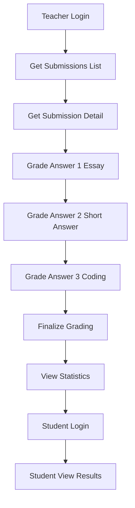

# Phase 7: Grading System - Testing Guide

## 📋 Mục Lục
1. [Giới Thiệu](#giới-thiệu)
2. [Prerequisites](#prerequisites)
3. [Setup Thunder Client](#setup-thunder-client)
4. [Workflow Testing](#workflow-testing)
5. [Test Cases Chi Tiết](#test-cases-chi-tiết)
6. [Troubleshooting](#troubleshooting)

---

## 🎯 Giới Thiệu

Guide này hướng dẫn chi tiết cách test **Phase 7: Grading System** của MS.TrustTest project.

**Phase 7 bao gồm:**
- Teacher APIs: Get submissions, grade answers, finalize grading, view statistics
- Student APIs: View exam results
- Full grading workflow từ SUBMITTED → GRADED
- Validation và error handling

**Test Collection:**
- File: `thunder-client-phase7-grading.json`
- Total requests: 25
- Folders: 6 (Authentication, Get Submissions, Grade Answers, Finalize & Stats, Student Results, Validation)

---

## ✅ Prerequisites

### 1. Backend Server Running
```bash
cd backend
mvn spring-boot:run
```

Verify server:
```
http://localhost:8080/api/actuator/health
```

### 2. Database Setup

Cần có test data từ Phase 5B:
- Teacher account: `teacher@example.com / teacher123`
- Student account: `student@example.com / student123`
- Sample exam với mixed question types (MC + Essay/Short Answer)
- Student submissions với status SUBMITTED

**Setup test data:**
```sql
-- Run file này nếu chưa có data
source database/test-data-phase5b.sql;
```

### 3. Thunder Client Variables

**Required variables** (Setup trong Thunder Client Environment):

```json
{
  "base_url": "http://localhost:8080",
  "teacher_token": "{{will_get_from_login}}",
  "student_token": "{{will_get_from_login}}",
  "exam_id": "1",
  "submission_id": "{{will_get_from_test}}",
  "answer_id": "{{will_get_from_submission_detail}}",
  "answer_id_2": "{{will_get_from_submission_detail}}",
  "answer_id_3": "{{will_get_from_submission_detail}}",
  "submission_id_not_graded": "{{optional}}",
  "other_submission_id": "{{optional}}",
  "other_class_submission_id": "{{optional}}"
}
```

---

## 🔧 Setup Thunder Client

### Step 1: Import Collection

1. Open Thunder Client extension trong VS Code
2. Click "Collections" tab
3. Click menu "⋮" → "Import"
4. Select file: `docs/thunder-client-phase7-grading.json`
5. Collection "Phase 7: Grading System" sẽ xuất hiện

### Step 2: Create Environment

1. Click "Env" tab
2. Click "New Environment"
3. Name: `MS.TrustTest - Phase 7`
4. Add variables:
```json
{
  "base_url": "http://localhost:8080",
  "exam_id": "1"
}
```

### Step 3: Set Active Environment

Click dropdown ở góc phải Thunder Client → Select "MS.TrustTest - Phase 7"

---

## 🚀 Workflow Testing

### Complete Grading Flow



### Quick Test Steps

**1. Authentication (Folder 0)**
- Run "Teacher Login" → Copy JWT token
- Update `teacher_token` variable
- Run "Student Login" → Copy JWT token  
- Update `student_token` variable

**2. Get Submissions (Folder 1)**
- Run "1.1. Get All Submissions" → Note submission_id từ response
- Update `submission_id` variable
- Run "1.5. Get Submission Detail" → Note các answer_id
- Update `answer_id`, `answer_id_2`, `answer_id_3` variables

**3. Grade Answers (Folder 2)**
- Run "2.1. Grade Essay Answer" (✅ Should succeed)
- Run "2.2. Grade Short Answer" (✅ Should succeed)
- Run "2.3. Grade Coding Answer" (✅ Should succeed)
- Run "2.4. Grade with Invalid Score" (❌ Should fail with 400)

**4. Finalize & Stats (Folder 3)**
- Run "3.2. Finalize Grading Successfully" (✅ Should succeed)
- Run "3.4. Get Exam Statistics" (✅ Should succeed)

**5. Student Results (Folder 4)**
- Run "4.2. View Results After Grading" (✅ Should succeed)

**6. Validation Tests (Folder 5)**
- Run all validation tests to verify error handling

---

## 📝 Test Cases Chi Tiết

### Folder 0: Authentication

#### 0.1. Teacher Login
```
POST {{base_url}}/api/auth/login

Body:
{
  "email": "teacher@example.com",
  "password": "teacher123"
}

Expected: 200 OK
Response: { "token": "eyJhbGc...", "user": {...} }

Action: Copy token value → Set teacher_token variable
```

#### 0.2. Student Login
```
POST {{base_url}}/api/auth/login

Body:
{
  "email": "student@example.com",
  "password": "student123"
}

Expected: 200 OK
Response: { "token": "eyJhbGc...", "user": {...} }

Action: Copy token value → Set student_token variable
```

---

### Folder 1: Teacher - Get Submissions

#### 1.1. Get All Submissions for Grading
```
GET {{base_url}}/api/grading/submissions
Authorization: Bearer {{teacher_token}}

Expected: 200 OK
Response: Array of GradingSubmissionListDTO
[
  {
    "id": 1,
    "examId": 1,
    "examTitle": "Java OOP Midterm",
    "studentId": 3,
    "studentName": "Nguyen Van A",
    "studentCode": "SV001",
    "submitTime": "2025-11-21T14:00:00",
    "status": "SUBMITTED",
    "pendingManualQuestions": 3,
    "autoGradedScore": 45.5,
    "maxScore": 100.0,
    "gradingProgress": 45.5
  }
]

Action: Note submission_id for next tests
```

#### 1.2. Get Submissions by Status
```
GET {{base_url}}/api/grading/submissions?status=SUBMITTED
Authorization: Bearer {{teacher_token}}

Expected: 200 OK
Response: Filtered submissions với status=SUBMITTED only
```

#### 1.3. Get Submissions by Exam ID
```
GET {{base_url}}/api/grading/submissions?examId={{exam_id}}
Authorization: Bearer {{teacher_token}}

Expected: 200 OK
Response: Submissions for specific exam only
```

#### 1.4. Get Submissions by Status AND Exam
```
GET {{base_url}}/api/grading/submissions?status=SUBMITTED&examId={{exam_id}}
Authorization: Bearer {{teacher_token}}

Expected: 200 OK
Response: Combined filter results
```

#### 1.5. Get Submission Detail by ID
```
GET {{base_url}}/api/grading/submissions/{{submission_id}}
Authorization: Bearer {{teacher_token}}

Expected: 200 OK
Response: GradingDetailDTO with full details
{
  "id": 1,
  "examTitle": "Java OOP Midterm",
  "studentName": "Nguyen Van A",
  "studentCode": "SV001",
  "submitTime": "2025-11-21T14:00:00",
  "status": "SUBMITTED",
  "answers": [
    {
      "id": 1,
      "questionId": 1,
      "questionText": "Giải thích 4 tính chất của OOP...",
      "questionType": "ESSAY",
      "maxScore": 10.0,
      "studentAnswer": "4 tính chất của OOP là...",
      "score": null,
      "feedback": null,
      "needsManualGrading": true
    },
    // ... more answers
  ],
  "totalQuestions": 10,
  "pendingManualQuestions": 3,
  "autoGradedScore": 45.5,
  "currentTotalScore": 45.5,
  "maxScore": 100.0
}

Action: Note answer_id values for Essay/Short Answer/Coding questions
```

---

### Folder 2: Teacher - Grade Answers

#### 2.1. Grade Essay Answer (Valid)
```
POST {{base_url}}/api/grading/answers/{{answer_id}}/grade
Authorization: Bearer {{teacher_token}}
Content-Type: application/json

Body:
{
  "score": 8.5,
  "feedback": "Bài làm tốt! Phân tích đúng các khái niệm OOP. Tuy nhiên cần bổ sung thêm ví dụ cụ thể về tính đa hình."
}

Expected: 200 OK
Response: Updated AnswerForGradingDTO
{
  "id": 1,
  "questionId": 1,
  "questionText": "Giải thích 4 tính chất của OOP...",
  "questionType": "ESSAY",
  "maxScore": 10.0,
  "studentAnswer": "4 tính chất của OOP là...",
  "score": 8.5,
  "feedback": "Bài làm tốt!...",
  "needsManualGrading": false
}
```

#### 2.2. Grade Short Answer (Valid)
```
POST {{base_url}}/api/grading/answers/{{answer_id_2}}/grade
Authorization: Bearer {{teacher_token}}
Content-Type: application/json

Body:
{
  "score": 7.0,
  "feedback": "Câu trả lời đúng nhưng chưa đầy đủ. Cần giải thích rõ hơn về cơ chế hoạt động."
}

Expected: 200 OK
```

#### 2.3. Grade Coding Answer (Valid)
```
POST {{base_url}}/api/grading/answers/{{answer_id_3}}/grade
Authorization: Bearer {{teacher_token}}
Content-Type: application/json

Body:
{
  "score": 9.0,
  "feedback": "Code chạy tốt, logic đúng. Tuy nhiên nên thêm exception handling và comment code."
}

Expected: 200 OK
```

#### 2.4. Grade with Invalid Score (Should Fail)
```
POST {{base_url}}/api/grading/answers/{{answer_id}}/grade
Authorization: Bearer {{teacher_token}}
Content-Type: application/json

Body:
{
  "score": 15.0,
  "feedback": "Test điểm vượt quá maxScore"
}

Expected: 400 Bad Request
Error: "Score cannot exceed maxScore (10.0)"
```

---

### Folder 3: Teacher - Finalize & Stats

#### 3.1. Try Finalize Without All Grades (Should Fail)
```
POST {{base_url}}/api/grading/submissions/{{submission_id}}/finalize
Authorization: Bearer {{teacher_token}}
Content-Type: application/json

Body:
{
  "generalFeedback": "Test hoàn thiện khi chưa chấm hết câu hỏi"
}

Expected: 400 Bad Request
Error: "Cannot finalize: 2 questions still need manual grading"

Note: Chỉ chạy test này nếu chưa grade hết tất cả subjective questions
```

#### 3.2. Finalize Grading Successfully
```
POST {{base_url}}/api/grading/submissions/{{submission_id}}/finalize
Authorization: Bearer {{teacher_token}}
Content-Type: application/json

Body:
{
  "generalFeedback": "Bài thi tổng thể tốt. Cần ôn lại phần thiết kế OOP và coding style. Tiếp tục phát huy!"
}

Expected: 200 OK
Response: Updated GradingDetailDTO
{
  "id": 1,
  "status": "GRADED",
  "currentTotalScore": 78.5,
  "maxScore": 100.0,
  "generalFeedback": "Bài thi tổng thể tốt...",
  // ... other fields
}

Action: Submission status changed to GRADED, totalScore calculated
```

#### 3.3. Try Finalize Again (Should Fail)
```
POST {{base_url}}/api/grading/submissions/{{submission_id}}/finalize
Authorization: Bearer {{teacher_token}}
Content-Type: application/json

Body:
{
  "generalFeedback": "Test hoàn thiện lại bài đã chấm"
}

Expected: 400 Bad Request
Error: "Submission is already graded"
```

#### 3.4. Get Exam Statistics
```
GET {{base_url}}/api/grading/stats/{{exam_id}}
Authorization: Bearer {{teacher_token}}

Expected: 200 OK
Response: Exam statistics
{
  "examId": 1,
  "examTitle": "Java OOP Midterm",
  "totalSubmissions": 5,
  "submittedCount": 2,
  "gradedCount": 3,
  "pendingCount": 2,
  "averageScore": 72.5,
  "highestScore": 95.0,
  "lowestScore": 45.0,
  "passRate": 80.0,
  "passingScore": 50.0
}
```

---

### Folder 4: Student - View Results

#### 4.1. Try View Result Before Grading (Should Fail)
```
GET {{base_url}}/api/exam-taking/results/{{submission_id_not_graded}}
Authorization: Bearer {{student_token}}

Expected: 400 Bad Request
Error: "Results not available yet. Status: SUBMITTED"

Note: Use a submission_id that hasn't been graded yet
```

#### 4.2. View Results After Grading (Success)
```
GET {{base_url}}/api/exam-taking/results/{{submission_id}}
Authorization: Bearer {{student_token}}

Expected: 200 OK
Response: StudentResultDTO
{
  "submissionId": 1,
  "examTitle": "Java OOP Midterm",
  "submitTime": "2025-11-21T14:00:00",
  "totalScore": 78.5,
  "maxScore": 100.0,
  "percentage": 78.5,
  "passed": true,
  "generalFeedback": "Bài thi tổng thể tốt...",
  "answers": [
    {
      "questionId": 1,
      "questionText": "Giải thích 4 tính chất của OOP...",
      "questionType": "ESSAY",
      "maxScore": 10.0,
      "studentAnswer": "4 tính chất của OOP là...",
      "score": 8.5,
      "feedback": "Bài làm tốt!...",
      "correctAnswer": null,  // Hidden for ESSAY
      "showCorrectAnswer": false
    },
    {
      "questionId": 2,
      "questionText": "Interface và Abstract Class khác nhau như thế nào?",
      "questionType": "MULTIPLE_CHOICE",
      "maxScore": 5.0,
      "studentAnswer": "A",
      "score": 5.0,
      "correctAnswer": "A",  // Shown if exam.showCorrectAnswers = true
      "showCorrectAnswer": true
    }
    // ... more answers
  ]
}

Note: correctAnswer visibility depends on exam.showCorrectAnswers setting
```

#### 4.3. Try View Another Student's Results (Should Fail)
```
GET {{base_url}}/api/exam-taking/results/{{other_submission_id}}
Authorization: Bearer {{student_token}}

Expected: 403 Forbidden
Error: "Access denied: You can only view your own results"
```

---

### Folder 5: Validation Tests

#### 5.1. Access Without Authentication (401)
```
GET {{base_url}}/api/grading/submissions

Expected: 401 Unauthorized
Error: "Full authentication is required"
```

#### 5.2. Access Invalid Submission ID (404)
```
GET {{base_url}}/api/grading/submissions/99999
Authorization: Bearer {{teacher_token}}

Expected: 404 Not Found
Error: "Submission not found with id: 99999"
```

#### 5.3. Grade Invalid Answer ID (404)
```
POST {{base_url}}/api/grading/answers/99999/grade
Authorization: Bearer {{teacher_token}}
Content-Type: application/json

Body:
{
  "score": 5.0,
  "feedback": "Test với answer ID không tồn tại"
}

Expected: 404 Not Found
Error: "Answer not found with id: 99999"
```

#### 5.4. Teacher Access Wrong Class Submission (403)
```
GET {{base_url}}/api/grading/submissions/{{other_class_submission_id}}
Authorization: Bearer {{teacher_token}}

Expected: 403 Forbidden
Error: "Access denied: You can only grade submissions from your classes"

Note: Requires test data with submissions from different classes
```

#### 5.5. Grade with Negative Score (400)
```
POST {{base_url}}/api/grading/answers/{{answer_id}}/grade
Authorization: Bearer {{teacher_token}}
Content-Type: application/json

Body:
{
  "score": -5.0,
  "feedback": "Test với điểm số âm"
}

Expected: 400 Bad Request
Error: "Score must be between 0 and maxScore"
```

---

## 🐛 Troubleshooting

### Common Issues

#### 1. 401 Unauthorized Error
**Problem:** Token expired or invalid
```
Solution:
1. Re-run authentication requests
2. Copy new JWT token
3. Update token variables
4. Retry failed request
```

#### 2. 404 Submission Not Found
**Problem:** submission_id không tồn tại trong database
```
Solution:
1. Run "1.1. Get All Submissions" to get valid IDs
2. Update submission_id variable
3. Verify data exists in database:
   SELECT * FROM exam_submissions WHERE deleted_at IS NULL;
```

#### 3. 400 Cannot Finalize - Questions Need Grading
**Problem:** Chưa grade hết các subjective questions
```
Solution:
1. Run "1.5. Get Submission Detail" 
2. Check which answers have needsManualGrading=true
3. Grade all pending answers first
4. Then run finalize again
```

#### 4. 403 Access Denied - Wrong Class
**Problem:** Teacher trying to grade submission from another class
```
Solution:
1. Verify teacher's assigned classes:
   SELECT * FROM subject_classes WHERE teacher_id = ?
2. Only grade submissions from own classes
3. Or use ADMIN account for testing
```

#### 5. Empty Submissions List
**Problem:** No submissions available for grading
```
Solution:
1. Create test submissions using Phase 5 APIs
2. Or run test data script:
   source database/test-data-phase5b.sql;
3. Verify submissions exist:
   SELECT * FROM exam_submissions WHERE status IN ('SUBMITTED', 'GRADED');
```

#### 6. Server Not Running
**Problem:** Connection refused error
```
Solution:
cd backend
mvn spring-boot:run

Wait for: "Started MsTrustExamApplication in X seconds"
```

---

## 📊 Test Coverage Summary

### Total Test Cases: 25

**By Category:**
- Authentication: 2 requests
- Get Submissions: 5 requests
- Grade Answers: 4 requests (3 valid + 1 validation)
- Finalize & Stats: 4 requests
- Student Results: 3 requests
- Validation: 7 requests

**By Expected Result:**
- ✅ Success (200): 17 requests
- ❌ Validation Error (400): 5 requests
- ❌ Unauthorized (401): 1 request
- ❌ Forbidden (403): 2 requests
- ❌ Not Found (404): 3 requests

**Coverage:**
- ✅ All 6 Phase 7 endpoints covered
- ✅ Happy path scenarios
- ✅ Validation & error cases
- ✅ Permission checks
- ✅ Complete grading workflow

---

## 🎓 Best Practices

### Testing Workflow

1. **Start Fresh:** Login mới để có token hợp lệ
2. **Follow Sequence:** Test theo thứ tự folders (0 → 5)
3. **Update Variables:** Copy IDs từ responses vào variables
4. **Verify Results:** Check response data matches expectations
5. **Test Errors:** Don't skip validation tests

### Data Management

1. **Backup Data:** Backup database trước khi test
2. **Reset Submissions:** Use reset script để tạo clean state
```sql
source database/reset-student-submissions.sql;
```
3. **Multiple Tests:** Create multiple submissions for testing

### Debugging

1. **Enable Logging:** Check backend console for errors
2. **Database Queries:** Verify data directly in MySQL
3. **Network Tab:** Use Thunder Client response viewer
4. **Error Messages:** Read error messages carefully

---

## 📞 Support

**Issues?**
- Check backend logs: `backend/logs/spring.log`
- Verify database state: MySQL Workbench
- Review API documentation: `docs/PHASE7-GRADING-SYSTEM-COMPLETE.md`

**Contact:**
- Developer: K24DTCN210-NVMANH
- Last Updated: 21/11/2025 14:40

---

**🎉 Happy Testing!**
